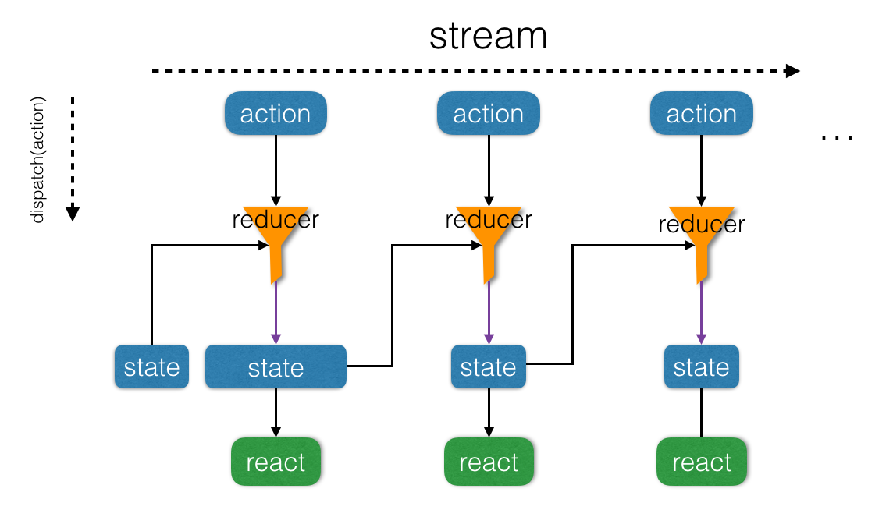

# 函数式编程在 Redux 中的应用

关键字: 复杂度、抽象、组合、序列、流、时间

## 复杂度以及抽象与组合

> 软件的首要技术使命是管理复杂度。 --代码大全

在软件开发的过程中，随着需求的变化和系统规模的增大，我们的软件不可避免的会变得复杂，如何对软件复杂度及其增长速度进行有效控制，便成为一个越来越突出的问题。

### 抽象

我们所处的整个世界的复杂性和多变性，而我们人类的大脑处理问题的能力相对是有限度的，比较“擅长”处理简单的事物。这就导致我们在认识世界的时候需要对整个世界做简化，将一般化和共性的事物和概念提取出来，形成理论和模型，进而指导我们对世界的改造，而简化的过程也即抽象的过程。

下面是关于抽象的一段描述：

> 心智活动，特别擅长利用各种简单的认识，主要表现在如下三个方面：
> 1)将若干简单认识组合为一个复合认识，由此产生出各种复杂的认识。
> 2)将两个认识放在一起对照，不管它们简单或者复杂，由此得到有关它们的相互关系的认识。
> 3)将有关认识与那些在实际中和它们同在的所有其它认识隔离开，这就是抽象，所有具有普遍性的认识都是这样得到的。
>                                                 —— John Locke (有关人类理解的随笔 1690)

### 组合

如上面所提到的，在进行抽象的过程中，我们不自觉地用到了另一种方法：组合，通过简单认识的组合可以构造出复杂的认识（或概念）。或者反之，在面对复杂事物的处理，我们通常会将其拆分许多小而简单部分，分而治之，然后在将这些部分组合起来，整个问题也便得到了解决。

软件开发的过程，本质上也是人类认识和改造世界的一种活动，所以在软件开发中也需要借助抽象和组合来处理复杂的需求和任务。

在 《SICP》 中描述了一种好的程序设计语言应该具备的特性：

- **基本表达形式**，用于表示语言所关心的最简单的个体。
- **组合的方法**，通过它们可以从较简单的东西出发构造出构造出复合的元素。
- **抽象的方法**，通过它们可以为复合对象命名，并将它们当作单元去操作。

并规定了其需要处理的两类要素：函数（过程）和数据。

## 高阶函数作为抽象

一种功能强大的语言，需要能为公共的模式命名，建立抽象，然后直接在抽象的层次上工作。

如果函数只能以数值或对象为参数，将会严重限制人们建立抽象的能力。经常会有一些同样的设计模式能用于若干不同的过程。为了将这种模式描述为相应的概念，就需要构造出这样的函数，使其以函数作为参数，或者将函数作为返回值。这类能操作函数的函数成为高阶函数。

map、filter 和 reduce 作为操作序列的通用模式抽象了出来。可以通过向这三个抽象出来的高阶函数注入具体的函数，生成处理具体问题的函数；进一步，通过组合这些生成的具体的函数，几乎可以解决所有序列相关的问题。以 map 为例，其定义了一大类相似的序列的操作，即对序列中每个元素进行转换，至于如何转换，需要向 `map` 传入一个具体的转换函数进行具体化。这些抽象出来的高阶函数相当于具有某类功能的通用型机器，而传入的具体函数相当于特殊零件，通用机器配上具体零件就可以应用于属于该大类下的各种具体场景了。

`map` 的重要性不仅体现在它代表了一种公共的模式，还体现在它建立了一种处理序列的高层抽象。迭代操作将人们的注意力吸引到对于序列中逐个元素的处理上，引入 `map` 抑制了这种细节层面上的情况，强调的是从源序列到目标序列的变换。这两种定义形式之间的差异，并不在于计算机会执行不同的计算过程（其实不会），而在于我们对这个同一过程的不同思考方式。从作用上看，`map` 帮我们建立了一层抽象屏障，将序列转换的函数实现，与如何提取序列中元素以及组合结果的细节隔离开。这种抽象也提供了新的灵活性，使我们有可能在保持从序列到序列的变换操作框架的同时，改变序列实现的底层细节。

例如，我们有一个序列：

```js
const list = [1, 5, 7, 3]
```

若对序列中的每个元素加 1：

```js
map(a => a + 1, list)
```

若对序列中的每个元素平方：

```js
map(a => a * a, list)
```

我们只需向 `map` 传入具体的转换函数，`map` 便会自动将函数映射到序列的的每个元素。

再举一例，现在有一份公司所有人员的月度考核表，我们想统计所有到店餐饮部所有开发人员 7 月份完成的任务总数，假设员工每月绩效结构如下：

```js
[{
  name: '张三',
  level: 'p2.1',
  segment: '到餐'
  tasks: 16,
  month: '201707',
  type: 'RD',
  ...
}, {
  name: '李四',
  level: 'p2.2',
  segment: '外卖'
  tasks: 29,
  month: '201707',
  type: 'QA',
  ...
}
...
]
```

我们可以这样做：

```js
const tasksInJuly = compose(
  reduce(add, 0),
  map(person => person.tasks),
  filter(person => person.type === 'RD'),
  filter(person => person.segment === '到餐')
)
```

通过上例，我们可以看到利用高阶函数进行抽象和组合的强大和简洁之处。这种通用的模式（模块）+ "具体函数" 组合的模式，显示通用模块广泛适用范围和处理具体问题时的灵活性。

高阶函数的重要性在于，使我们可以显示地使用程序设计元素描述过程抽象，并能像操作其他元素一样去操作它们。

通常，程序设计语言总会对基本元素的可能使用方式进行限制。带有最少限制的元素被称为一等公民，包括的 "权利或者特权" 如下所示：

- 可以使用变量命名；
- 可以提供给函数作为参数；
- 可以由函数作为结果返回；
- 可以包含在数据结构中；

在 JavaScript 中，函数被看作是一等公民。

## 流

由上述过程我们得到了一种新的模式，数据流。信号处理工程师可以很自然的用流过一些级联的处理模块的信号的方式来描述这一过程。例如我们输入公司全员月度考核信息作为信号，首先会流过两个过滤器，将所有不符合要求的数据过滤掉，这样得到的信号有通过一个映射，这是一个 "转换装置"，它从完整的员工对象转换为对应的任务信息。这一映射的输出被馈入一个累加器，该装置用 `add` 将所有的元素组合起来，以初始的 0 开始。

要组织好这些过程，最关键的是将注意力集中在处理过程中从一个步骤流向下一个步骤的 "信号"。如果我们用序列来表示这些信号，就可以利用序列操作实现每一步骤的处理。流模式作为一种非常强大的组织策略，在下文中还会有详细地讲解

或许因为序列操作模式非常具有一般化的性质，于是人们发明了一门专门处理序列的语言 Lisp（LISt Processor)。。。

将程序表示为针对序列的操作，这样做的价值就在于能帮助我们得到模块化的程序设计，也就是说，得到由一些比较独立的片段的组合构成的设计。通过提供一个标准部件的库，并使这些部件都有着一些能以各种灵活方式相互连接的约定接口，将能进一步推动人们去做模块化的设计。流可以看作纵向的组合，要想进行良好的组合，需要满足一些条件，就是接下来要讲的闭包。

## 闭包

> 100 个函数操作一种数据结构的组合，要好过 10 个函数操作 10 中数据结构的组合。 -- Alan Perlis

"闭包" 来自与抽象代数，在抽象代数中，一个集合元素称为在某个运算（操作）之下是封闭的，如果将该运算应用于这一集合中的元素，产生出的仍然是该集合里的元素。（这与传统程序中的 ["闭包"](https://en.wikipedia.org/wiki/Closure_(computer_programming)) 概念是不同的）。

一般说，某种组合数据对象的操作满足闭包性质，那就是说，通过它组合起数据对象得到的结果本身还可以通过同样的操作在进行组合。闭包性质是任何一种组合功能的威力的关键要素，因为它是我们能够建立起层次性的结构，这种结构有一些部分构成，而其中的各个部分又是有他们的部分构成，并且可以如此继续下去。

例如，序列中的 `map`、`filter` 操作，React 中的高阶组件，Redux 中的高阶reducer，都满足闭包性质，因此都是可以组合的。

在面向对象的程序设计中，复用的单元表现在类和用作类间通信的消息。人们喜欢针对各种具体的问题大量建立有很多操作的各种数据结构。这种以对象作为一等公民的形式，由于产生了大量的数据结构，使闭包的实现变得困难重重。人们不得不针对特定对象编写特定的函数，降低了组合的适用范围。

而在函数式程序中侧重于函数的复用性，这种范式提倡在少量的数据结构上使用多种共通的变换，并通过具体低阶函数来调整操作来满足具体事项的要求。数据结构越少，整个系统的封闭性就越好。

## 分层设计

一个复杂的系统应该通过一系列的层次构造出来，为了描述这些层次，需要使用一系列的语言。构造各个层次的方式，就是设法组合其作为这一层次中部件的各种基本要素，而这些构造出的部件又可以作为另一个层次的基本元素。在分层设计中，每个层次上所用的语言都提供了一些基本元素、组合手段，还有对该层次中的适当细节做抽象的手段。

例如，React 将 View 层提取出来，抽象为只用来展示的组件（可能带有少量自身的状态管理），将其与具体的业务场景解耦。我们在其中使用 JSX、Css、Html、JavaScript 等特定的语言进行设计，在内部可以对多个组件进行横向或者纵向的组合，然后以模块的形式对接数据层。又由于 React 组件可以看做纯函数，所以 View 层可以抽象为随数据变化的函数：

```js
View = f(Data)
```

代码中的 `f` 函数，可以看作数据层到 View 层的映射或绑定。

分层设计有助于使程序更加强健，使我们更有可能在给定范围发生一些变化时，只需对程序做少量的修改。

## 流、状态、时间

在前面，我们已经看到了组合和抽象在克服大型系统复杂性方面所起的作用。但仅有这些还不够，有效的程序综合还需要一些良好的指导原则，它们能指导我们系统化地完成系统的整体设计。特别是需要一些能够帮助我们构造起模块化的大型系统的策略。

有一种非常强有力的设计策略，特别适合用于构造那类模拟真实物理系统的程序，那就是基于被模拟系统的结构去设计程序的结构。对于相关的物理系统的每个对象，我们构造起一个与之对应的计算对象；对该系统里的每种活动，我们在自己的计算系统中定义一种符号操作。系统中有新对象或新活动扩充对应的计算模型时，不必对程序全面的修改，只需要加上与这些对象或者活动相对应的新的符号对象即可。没错，这就是面向对象程序设计。

面向对象组织策略将注意力集中在对象上，将一个大型系统看成一大批对象，它们的状态和行为可能随着时间的进展而不断变化。另一种组织策略将注意力集中在流过系统的信息流上，很像电子工程师观察一个信号处理系统。

基于对象的途径和基于流处理的途径，都对程序设计提出了具有重要意义的语言要求。对于对象途径而言，我们必须关注计算对象会怎样变化而又同时保持其状态。这会迫使我们不得不与难以把控的环境模型打交道。在处理对象、变化和状态时，各种困难的根源在于我们需要在这一计算模型中与时间搏斗。流能缓和状态模拟中的复杂性。

在面向对象的模型中，每一个计算对象必须有它自己的局部变量。用于描述实际对象的状态。对象的状态是随着时间变化的。如果我们确定了要通过计算机里的时间顺序去模拟实际系统里的时间流逝，那么我们就要构造起一些计算对象，使它们的行为随着程序的运行而改变。特别是，如果我们希望通过程序设计里常规的符号名字去模拟状态变量，那么语言里就必须提供一个赋值运算符，使我们能用它去改变与一个名字相关联的值。而这就是可变数据结构。

广泛采用赋值的程序设计被称为命令式程序设计，它会导致计算模型的复杂性。

只要不使用赋值，以同样的参数对同一函数的两次求值一定产生出同样的结果，因此就可以认为函数是在计算数学函数。不用任何赋值的程序设计称为函数式程序设计。

如果一个语言支持在表达式里 "同一的东西可以相互替换" 的观念，这样的替换不会改变有关表达式的值，这个语言就被称为是具有引用透明性。在程序里面如果存在赋值，就打破了引用透明性，是确定能够通过等价的表达式代换去简化表达式变成了异常错综复杂的问题，对使用赋值的程序做推理也将变得极其困难。

在试图模拟真实世界中的现象时，我们做了一些 "合理" 的决策：用具有局部状态的计算对象去模拟真实世界里具有局部状态的对象；用计算机里面随着时间的变化去表示真实世界里随着时间的变化；在计算机里，被模拟对象随着时间的变化是通过对那些模拟对象中局部变量的赋值实现的。

还有更好的办法吗？我们能够避免让计算机里的时间去对应于真实世界里的时间吗？我们必须让相应的模型随着时间变化，以便去模拟真实世界中的现象吗？如果以数学函数的方式考虑这些问题，我们可以将一个量 `x` 的随时间而变化的行为，描述为一个时间的函数 `x(t)`。如果我们想几种关注的是一个个时刻的 `x`，那么就可以将它看做一个变化着的量。然而，如果我们关注的是这些值的整个时间史，那么就不需要强调其中的变化 -- 这一函数本省并没有变化。

如果用离散的步长去度量时间，那么就可以用一个（可能无穷的）序列去模拟一个时间函数、模拟变化，以这种序列表示被模拟系统随着时间变化的历史。为了做到这些，我们需要引进一种称为流的新数据结构。从抽象的角度看，一个流也是一个序列（甚至无穷的序列）。

流处理是我们可以模拟一些包含状态的系统，但却不需要赋值或者变动数据，能避免由于引进了赋值而带来的内在缺陷。

例如在前端开发中，一般会用对象模型（DOM）来模拟和直接操控网页，随着与用户不断交互，网页的局部状态不断被修改，其中的行为也会随时间不断变化。随着时间的推移，我们页面状态管理变得异常复杂，以至于最终我们自己也不知道网页当前的状态和行为。

为了克服对象模型随时间变化带来状态管理困难境况，我们引入了 Redux，也就是上面提到的流处理模式，将页面状态 `state` 看作时间的函数 `state(t)`，因为状态的变化是离散的，所以我们也可以写成 `state(n)` 。通过提取 `state` 并显示的增加时间维度，我们将网页的对象模型转变为流处理模型，用 `state[]` 序列表示网页随着时间变化的历史。

由于 `state` 可以看做整个时间轴上的无穷（具有延时）序列，并且我们在之前已经构造起了对序列进行操作的功能强大的抽象机制，所以可以利用这些序列操作函数处理 `state` 。

Redux 提供了 reducer 函数来模拟 `reduce` , reducer 的类型签名为 `reducer:: prevState -> action -> state`，接受上一次状态，和当前时刻 dispatch 过来的 action，生成当前的状态 state。当前的 state 又可以作为下一次迭代的状态参数传入。如下图所示：



可以将 Redux 和 React 组合起来:

```js
React-Redux： 

View(t) = react(state(t)) = compose(react, state)(t)

-> View = compose(react, state)
```

由于 react 组件本身也是纯函数，所以 react 对 `state` 可以进行缓存，如果 state 没有变化，就还用之前的网页，页面不需要重新渲染。（相当于页面缓存）

本文许多文本来自于《SICP》和 《函数式编程思维》，并有一小部分函数式编程思维在前端的实践。
