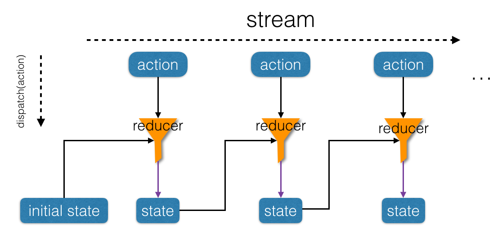

# 函数式编程在 Redux / React 中的应用

关键字: 复杂度、抽象、组合、序列、流、时间

## 复杂度以及抽象与组合

### 复杂度

> 软件的首要技术使命是管理复杂度。 --代码大全

在软件开发的过程中，随着需求的变化和系统规模的增大，我们的软件不可避免的会变得复杂，如何对软件复杂度及其增长速度进行有效控制，便成为一个日益突出的问题。

### 抽象

我们所处的世界复杂而多变，而人脑处理问题的能力是相对有限的。这就导致我们在认识世界的时需要对整个世界简化，将一般化和共性的概念提取出来，形成理论和模型；进而反过来指导我们对世界的改造。而简化的过程也即抽象的过程。

### 组合

如上面所提到的，在进行抽象的过程中，我们不自觉地用到了另一种方法：组合，通过简单认识的组合可以构造出复杂的认识（或概念）。或者反之，在面对复杂事物的处理，我们通常会将其拆分许多小而简单部分，分而治之，然后再将这些部分组合起来，整个问题便得到了解决。

软件开发的过程，本质上也是人类认识和改造世界的一种活动，所以在软件开发中也需要借助抽象和组合来处理复杂的需求和任务。

在 《SICP》 中描述了一种好的程序设计语言应该具备的特性：

- **基本表达形式**，用于表示语言所关心的最简单的个体。
- **组合的方法**，通过它们可以从较简单的东西出发构造出构造出复合的元素。
- **抽象的方法**，通过它们可以为复合对象命名，并将它们当作单元去操作。

并规定了其需要处理的两类要素：函数（过程）和数据。

## 高阶函数作为抽象

一种功能强大的语言，需要能为公共的模式命名，建立抽象，然后直接在抽象的层次上工作。

如果函数只能以数值或对象为参数，将会严重限制人们建立抽象的能力。经常会有一些同样的设计模式能用于若干不同的过程。为了将这种模式描述为相应的概念，就需要构造出这样的函数，使其以函数作为参数，或者将函数作为返回值。这类能操作函数的函数成为高阶函数。

map、filter 和 reduce 作为操作序列的通用模式抽象了出来。可以通过向这三个抽象出来的高阶函数注入具体的函数，生成处理具体问题的函数；进一步，通过组合这些生成的具体的函数，几乎可以解决所有序列相关的问题。以 map 为例，其定义了一大类相似的序列的操作，即对序列中每个元素进行转换，至于如何转换，需要向 `map` 传入一个具体的转换函数进行具体化。这些抽象出来的高阶函数相当于具有某类功能的通用型机器，而传入的具体函数相当于特殊零件，通用机器配上具体零件就可以应用于属于该大类下的各种具体场景了。

`map` 的重要性不仅体现在它代表了一种公共的模式，还体现在它建立了一种处理序列的高层抽象。迭代操作将人们的注意力吸引到对于序列中逐个元素的处理上，引入 `map` 抑制了这种细节层面上的情况，强调的是从源序列到目标序列的变换。这两种定义形式之间的差异，并不在于计算机会执行不同的计算过程（其实不会），而在于我们对这个同一过程的不同思考方式。从作用上看，`map` 帮我们建立了一层抽象屏障，将序列转换的函数实现，与如何提取序列中元素以及组合结果的细节隔离开。这种抽象也提供了新的灵活性，使我们有可能在保持从序列到序列的变换操作框架的同时，改变序列实现的底层细节。

例如，我们有一个序列：

```js
const list = [1, 5, 7, 3]
```

若对序列中的每个元素加 1：

```js
map(a => a + 1, list)
```

若对序列中的每个元素平方：

```js
map(a => a * a, list)
```

我们只需向 `map` 传入具体的转换函数，`map` 便会自动将函数映射到序列的的每个元素。

再举一例，现在有一份公司所有人员的月度考核表，我们想统计所有到店餐饮部所有开发人员 7 月份完成的任务总数，假设员工每月绩效结构如下：

```js
[{
  name: '张三',
  level: 'p2.1',
  segment: '到餐'
  tasks: 16,
  month: '201707',
  type: 'RD',
  ...
}, {
  name: '李四',
  level: 'p2.2',
  segment: '外卖'
  tasks: 29,
  month: '201707',
  type: 'QA',
  ...
}
...
]
```

我们可以这样做：

```js
const tasksInJuly = compose(
  reduce(add, 0),
  map(person => person.tasks),
  filter(person => person.type === 'RD'),
  filter(person => person.segment === '到餐')
)
```

[`compose`](http://ramdajs.com/docs/#compose) 是用来做函数组合的，上一个函数的输出作为下一个函数的输入，可以类比流水线及组成流水线的工作台。每个可组合的函数相当于流水线上的工作台，每个工作台对工件进行筛选、加工等，然后输出，作为下一个工作台的输入。

通过上例，我们可以看到利用高阶函数进行抽象和组合的强大和简洁之处。这种通用模式（模块）+ "具体函数" 组合的模式，显示通用模块广泛适用性和处理具体问题时的灵活性。

高阶函数的重要性在于，使我们可以显式地使用程序设计元素描述过程抽象，并能像操作其他元素一样去操作它们。

通常，程序设计语言总会对基本元素的可能使用方式进行限制。带有最少限制的元素被称为一等公民，包括的 "权利或者特权" 如下所示：

- 可以使用变量命名；
- 可以提供给函数作为参数；
- 可以由函数作为结果返回；
- 可以包含在数据结构中；

在 JavaScript 中，函数被看作是一等公民。

## 流

由上述过程我们得到了一种新的模式，数据流。信号处理工程师可以很自然的用流过一些级联的处理模块的信号的方式来描述这一过程。例如我们输入公司全员月度考核信息作为信号，首先会流过两个过滤器，将所有不符合要求的数据过滤掉，这样得到的信号又通过一个映射，这是一个 "转换装置"，它将完整的员工对象转换为对应的任务信息。这一映射的输出被馈入一个累加器，该装置用 `add` 将所有的元素组合起来，以初始的 0 开始。

要组织好这些过程，最关键的是将注意力集中在处理过程中从一个步骤流向下一个步骤的 "信号"。如果我们用序列来表示这些信号，就可以利用序列操作实现每步处理。流模式作为一种非常强大的组织策略，在下文中还会有详细地讲解。

或许因为序列操作模式非常具有一般化的性质，于是人们发明了一门专门处理序列的语言 Lisp（LISt Processor)。。。

将程序表示为针对序列的操作，这样做的价值就在于能帮助我们得到模块化的程序设计，也就是说，得到由一些比较独立的片段的组合构成的设计。通过提供一个标准部件的库，并使这些部件都有着一些能以各种灵活方式相互连接的约定接口，将能进一步推动人们去做模块化的设计。流可以看作纵向的组合，要想进行良好的组合，需要满足一些条件，就是接下来要讲的闭包。

## 闭包

> 100 个函数操作一种数据结构的组合，要好过 10 个函数操作 10 中数据结构的组合。 -- Alan Perlis

"闭包" 来自与抽象代数，在抽象代数中，一个集合元素称为在某个运算（操作）之下是封闭的，如果将该运算应用于这一集合中的元素，产生出的仍然是该集合里的元素。（这与传统程序中的 ["闭包"](https://en.wikipedia.org/wiki/Closure_(computer_programming)) 概念是不同的）。

一般说，某种组合数据对象的操作满足闭包性质，那就是说，通过它组合起数据对象得到的结果本身还可以通过同样的操作在进行组合。闭包性质是组合功能威力强大的关键要素，因为它使我们能够建立起层次性的结构，这种结构有一些部分构成，而其中的各个部分又是由他们的子部分构成，并且可以如此继续下去。

例如，序列中的 `map`、`filter` 操作，React 中的高阶组件，Redux 中的高阶reducer，都满足闭包性质，因此也都是可以组合的。

在面向对象的程序设计中，复用的单元表现在类和用作类间通信的消息。人们喜欢针对各种具体的问题大量建立有很多操作的各种数据结构。这种以对象作为一等公民的形式，由于产生了大量的数据结构，使闭包的实现变得困难重重。人们不得不针对特定对象编写特定的函数，降低了组合的适用范围。

而在函数式程序中侧重于函数的复用性，这种范式提倡在少量的数据结构上使用多种共通的变换，并通过具体低阶函数来调整操作来满足具体事项的要求。数据结构越少，整个系统的封闭性就越好。

## 分层设计

一个复杂的系统应该通过一系列的层次构造出来，为了描述这些层次，需要使用一系列的语言。构造各个层次的方式，就是设法组合其作为这一层次中部件的各种基本要素，而这些构造出的部件又可以作为另一个层次的基本元素。在分层设计中，每个层次上所用的语言都提供了一些基本元素、组合手段，还有对该层次中的适当细节做抽象的手段。

例如，React 将 View 层提取出来，抽象为只用来展示的组件（可能带有少量自身的状态管理），将其与具体的业务场景解耦。我们在其中使用 JSX、Css、Html、JavaScript 等特定的语言进行设计，在内部可以对多个组件进行横向或者纵向的组合，然后以模块的形式对接数据层。又由于 React 组件可以看做纯函数，所以 View 层可以抽象为随数据变化的函数：

```js
View = f(State)
```

代码中的 `f` 函数，可以看作数据层到 View 层的映射或绑定。

再例如，Redux 将 Model 层提取出来，抽象为只做状态管理的数据层。其中包括所有页面数据管理和逻辑处理。数据层内部又可以根据功能的不同细分为不同的部分（不同的reducer），然后通过 `combineReducers` 将多个 reducers 组合为一个大的 `reducer` 暴露给外部。

分层设计有助于使程序更加强健，使我们更有可能在给定范围发生一些变化时，只需对程序做少量的修改。

## 流、状态、时间

在前面，我们已经看到了组合和抽象在克服大型系统复杂性方面所起的作用。但仅有这些还不够，有效的程序综合还需要一些良好的指导原则，它们能指导我们系统化地完成系统的整体设计。特别是需要一些能够帮助我们构造起模块化的大型系统的策略。

我们有两种组织策略：面向对象和流式操作。

面向对象组织策略将注意力集中在对象上，将一个大型系统看成一大批对象，它们的状态和行为可能随着时间的进展而不断变化。流式操作组织策略将注意力集中在流过系统的信息流上，很像电子工程师观察一个信号处理系统。

在利用面向对象模式模拟真实世界中的现象时，我们做了一些 "合理" 的决策：用具有局部状态的计算对象去模拟真实世界里具有局部状态的对象；用计算机里面随着时间的变化去表示真实世界里随着时间的变化；在计算机里，被模拟对象随着时间的变化是通过对那些模拟对象中局部变量的赋值实现的。

我们必须让相应的模型随着时间变化，以便去模拟真实世界中的现象吗？答案是否定的。如果以数学函数的方式考虑这些问题，我们可以将一个量 `x` 的随时间而变化的行为，描述为一个时间的函数 `x(t)`。如果我们集中关注的是一个个时刻的 `x`，那么就可以将它看做一个变化着的量。如果我们关注的是这些值的整个时间史，那么就不需要强调其中的变化 -- 这一函数本身并没有变化。

如果用离散的步长去度量时间，那么就可以用一个（可能无穷的）序列去模拟一个时间函数、模拟变化，以这种序列表示被模拟系统随着时间变化的历史。为了做到这些，我们需要引进一种称为流的新数据结构。从抽象的角度看，一个流也是一个序列（甚至无穷的序列）。

流处理使我们可以模拟一些包含状态的系统，但却不需要赋值或者变动数据，能避免由于引进了赋值而带来的内在缺陷。

例如在前端开发中，一般会用对象模型（DOM）来模拟和直接操控网页，随着与用户不断交互，网页的局部状态不断被修改，其中的行为也会随时间不断变化。随着时间的推移，我们页面状态管理变得异常复杂，以至于最终我们自己也不知道网页当前的状态和行为。

为了克服对象模型随时间变化带来状态管理困境，我们引入了 Redux，也就是上面提到的流处理模式，将页面状态 `state` 看作时间的函数 `state = state(t) -> state = stateF(t)`，因为状态的变化是离散的，所以我们也可以写成 `stateF(n)` 。通过提取 `state` 并显式地增加时间维度，我们将网页的对象模型转变为流处理模型，用 `[state]` 序列表示网页随着时间变化的状态。

由于 `state` 可以看做整个时间轴上的无穷（具有延时）序列，并且我们在之前已经构造起了对序列进行操作的功能强大的抽象机制，所以可以利用这些序列操作函数处理 `state` 。这里我们用到的是 `reduce` 操作。

## 从 reduce 到 redux

### reduce

`reduce` 是对列表的迭代操作的抽象，`map` 和 `filter` 都可以基于 `reduce` 进行实现。Redux 借鉴了 `reduce` 的思想，是 `reduce` 在时间流处理上的一种特殊应用，下面我们来看一下，Redux 是由怎样 `reduce` 一步步推导出来的。

首先我们来看一下 `reduce`, 其类型签名如下所示：

```js
reduce :: ((a, b) -> a) -> a -> [b] -> a

reduce :: (reducer, initialValue, list) -> result
reducer :: (a, b) -> a
initialValue :: a
list :: [b]
result :: a
```

上述类型签名采用的是 [Hindley-Milner](https://en.wikipedia.org/wiki/Hindley%E2%80%93Milner_type_system) 类型系统，接触过 Haskell 的的同学可能对此比较熟悉。其中双冒号左边部分为函数或参数名称，右边部分为该函数或参数的类型。

`reduce` 接受三个参数: 累积器 `reducer` ，累积初始值 `initialValue`，待累积列表 `list` 。我们迭代遍历列表的元素，利用累积器`reducer` 对累积值和列表当前元素进行累积操作，`reducer` 输出新累积值作为下次累积操作操作的输入。依次循环迭代，直到列表遍历结束，将此时的累积值作为 `reduce` 最终累积结果输出。

`reduce` 在某些编程语言中也被称为 `foldl`。中文翻译有时也被称为折叠、归约等。如果将列表看做是一把展开的扇子，列表中的每个元素看做每根扇骨（上的内容），则 `reduce` 的过程也即扇子从左到右不断折叠（归约、累积）的过程。当扇子完全合上，一次折叠也即完成。当然，折叠顺序也可以从右向左进行，即为 `reduceRight` 或 `foldr`。


`reduce` 代码实现如下：

```js
const reduce = (reducer, initialValue, list) => {
  let acc = initialValue;
  let val;
  for(i = 0, i < list.length, i++) {
    val = list[i];
    acc = reducer(acc, val);
  }
  return acc;
};
```

举例说明，我们对一个数字列表 `[2, 3, 4]` 进行累加操作（初始值为 1 )，可以表示为:

```js
reduce((a, b) => a + b, 1, [2, 3, 4])
```

示意图如下所示：


介绍完 `reduce` 的基本概念，接下来展示如何由 `reduce` 一步步推导出 Redux，以及 Redux 各部分与 `reduce` 的映射关系。

### Redux

首先定义出 Redux 的类型签名：

```js
redux :: ((state, action) -> state) -> initialState -> [action] -> state
redux :: (reducer, initialState, stream) -> result

reducer :: (state, action) -> state
initialState :: state
list :: [action]
result :: state
```

将 `reduce` 参数的名称变换一下，便得到 redux 的类型签名。从类型签名看，Redux 参数包含 `reducer` 函数，state 初始值 `initialState` ，和一个以 `action` 为元素的时间流列表 `stream :: [action]`；返回值为最终的状态 `state`。

下面看一下 Redux 的初步实现：

```js
const redux = (reducer, initialState, stream) => {
  let state = initialState;
  let action;
  for(i = 0, i < stream.length, i++) {
    action = stream[i];
    state = reducer(state, action);
  }
  return state;
}
```

解析一下上述代码。

首先设置 Redux `state` 的初始值 `initialState`， `stream` 代表时间流列表，`action = stream[i]` 代表某个时间点发生的一次 `action`；每次 `for` 循环，我们将当前的状态 `state` 和 `action` 传给 `reducer` 函数，根据本次 `action` 对当前 `state` 进行更新，产生新的 `state`。新的 `state` 作为下次 action 发生时的 `state` 参与状态更新。

Redux 基本原理其实已经讲完了，Redux 的各个概念如：`reducer` 函数、`state`、 `stream :: [action]` 也是和 `reduce` 一一对应的。不同之处在于，redux 中的列表 `stream`，是一个随时间不断生成的无限长的 `action` 动作列表，而 `reduce` 中的列表是一个普通的 `list`。

等一下，上述 Redux 实现貌似缺了些什么。。。是的，在 Redux 中，状态的改变和获取是通过两个函数来操作的：`dispatch`、`getState`。接下来我们将这两个函数添加进去：

```js
const redux = (reducer, initialState, stream) => {
  let currentState = initialState;
  let action;

  const dispatch = action => {
    currentState = reducer(currentState, action);
  };
  const getState = () => currentState;

  for(i = 0, i < stream.length, i++) {
    action = stream[i];
    dispatch(action);
  }
  return state; // the end of the world :)
}
```

这样我们就可以通过 `dispatch(action)` 来更新当前的状态了，通过 `getState` 也可以拿到当前的状态。

但是还是感觉不太对？在上述实现中，`stream` 并不是现实中的时间（事件）流，只是普通的列表而已，`dispatch` 和 `getState` 接口也并没有暴露给外部，同时在 `redux` 最后还有一个 `return state` ，既然说过 `stream` 是一个无限长的列表，那 `return state` 貌似没有什么意义啊。

好吧，上述两次 Redux 代码实现，其实都是对 Redux 原理的说明而已，下面我们来真正实现一个现实中可运行的最小 Redux 代码片段：

```js
const redux = (reducer, initialState) => {
  let currentState = initialState;

  const dispatch = action => {
    currentState = reducer(currentState, action);
  };
  const getState = () => currentState;

  return ({
    dispatch,
    getState,
  };
};

const store = redux(reducer, initialState);
const action = { type, payload };
store.dispatch(action);
store.getState();
```

Yes! 我们将 `stream` 从 redux 函数中抽离出来，或者说是从电脑屏幕上抽取到现实世界中来了。

我们首先使用 `reducer` 和 `initialState` 初始化 redux 为 `store`,；然后现实中每次事件时，发生我们通过 `store.dispatch(action)` 更新 store 中状态，同时通过 `store.getState()` 来获取 `store` 的当前状态。

等等，这怎么听着像是面向对象的编程方式，对象中包含私有变量：`currentState` 和操作私有变量的方法：`dispatch` 和 `getState`。

```java
const store = {
  private currentState: initialState,
  public dispatch: (action) => {...},
  public getState: () => state,
}
```

是的，从这个角度讲，我们确实是用了函数式的过程实现了一个面向对象的概念。

如果你再仔细看的话，我们是用的[闭包](https://en.wikipedia.org/wiki/Closure_(computer_programming))(编程领域的闭包，与上面论述的闭包不同)实现的这个对象，虽然最后的 `redux` 实现返回的是形式为 `{ dispatch, getState }`  `store` 对象，但 `dispatch` 和 `getState` 捕获了 `redux` 内部创建的 `currentState`，因此形成了闭包。

Redux 的运作过程如下所示：



我们来总结一下 `redux` 和 `reduce` 的联系与区别。

相同点：

- reduce 和 redux 都是对数据流进行 fold （折叠、归约）；

- 两者都包含一个累积器(reducer)（(a, b) -> a VS (state, action) -> state ）和初始值（initialValue VS initialState ），两者都接受一个抽象意义上的列表（list VS stream ）。

不同点：

- reduce：接收一个有限长度的普通列表作为参数，对列表中的元素从前往后依次累积，并输出最终的累积结果。

- redux：由于基于时间的事件流是一个无限长的抽象意义上的列表，我们无法显式地将事件流作为参数传给 redux，也无法返回最终的累积结果（由于时间流无限长）。所以我们将事件流抽离出来，通过 `dispatch` 主动地向 `reducer` 累积器 push 列表元素 `action`，通过 `getState` 观察当前的累积值（中间的累积过程）。

- 从冷热信号的角度看，reduce 的输入相当于冷信号，累积器需要主动拉取（pull）输入列表中的元素进行累积，而 Redux 的输入（事件流）相当于热信号，需要外部主动调用 `dispatch(action)` 将当前元素 push 给累积器。

由上可知，Redux 将所有的事件都抽象为 action，无论是用户点击、ajax 请求还是页面刷新，只要有新的事件发生，我们就会 dispatch 一个 action 给 reducer，并结合上一次的状态计算出本次状态。统一的事件接口简化了处理事件的复杂度。

Redux 规范还了事件流 -- 单向事件流，事件 `action` 只能由 `dispatch` 函数派发，并且只能通过 `reducer` 更新系统（网页）的状态 state，然后等待下一次事件。这种单向事件流机制能够进一步简化事件管理的复杂度，并且有较好的扩展性，可以在事件流动过程中插入 middleware，比如日志记录、thunk、异步处理等，进而大大增强事件处理的灵活性。

### transduce 和 enhance redux

`transduce` 作为增强版的 `reduce`，是在 [Clojure](https://clojure.org/reference/transducers) 中首次引入的。transduce 相当于 compose 和 reduce 的组合，相对于 reduce 改进之处为：列表中的每个元素在放入累积器之前，先对其进行一系列的处理。这样做的好处是同时降低的代码的时间复杂度和空间复杂度。

假设有一个长度为 n 的列表，传统列表处理的做法是先用 compose 组合一系列列表处理函数对列表进行转换处理，最后对处理好的列表进行归约（reduce）。假设我们组合了 m 个列表处理函数，加上最后一次 reduce，时间复杂度为 n * (m + 1)；而使用 transduce 只需要一次循环，所以时间复杂度为 n 。由于 compose 的每个处理函数都会产生中间结果，且这些中间结果有时会占用很大的内存，而 transduce 边转换边累积，没有中间结果产生，所以空间复杂度也得到了有效的控制。


我们也可以对 redux 进行类似地增强优化，每次 `dispatch(action)` 时，我们也根据 `action` 进行一系列操作，最后传给 `reducer` 函数进行真正的状态更新。这就是上文提到的 redux middleware。redux 是一个功能和扩展性非常强的状态管理库，而围绕 redux 产生的一系列优秀的 middlewares 让 redux/react 形成了一个强大的前端生态系统。个人认为 redux/react 自身良好的架构、先进的理念，加上一系列优秀的第三方插件的支持，是 react/redux 成功的关键所在。


### React

Redux 可以用作 React 的数据管理（数据源），所以我们可以将 Redux 和 React 组合起来:

```js
React-Redux： 

View = react(state)

// 增加时间维度
let state = stateF(t)

-> View(t) = t => react(stateF(t)) = t => compose(react, stateF)(t) = compose(react, stateF)

-> View = compose(react, stateF)
```


这样从各个具体的 state 来看，state 是随着时间变化的；而从整个时间轴来看，state[] 是一个无穷序列，每个位置上都是以 t 为索引的固定值，没有变化；从 state(t) 角度看，state 是一个关于 t 的纯函数，也没有变化。将时间维度显式表示出来，有利于我们对系统的状态把控（如回溯、跟踪、分析、调试等）。

## 纯函数、引用透明、缓存

> 纯函数的定义：相同的输入，永远会得到相同的输出，并且没有副作用。

纯函数的运算既不受外部环境和内部不确定性因素的影响，也不会影响外部环境。输出只与输入有关。

由此可得纯函数的一些优点：可缓存、引用透明、可等式推导、可预测、单测友好、易于并发操作等。

其实函数式编程中的纯函数指的是数学意义上的函数，数学中的函数定义为：

> 函数是不同数值之间的特殊关系：每一个输入值返回且只返回一个输出值。

从集合的角度讲，函数分为三部分：定义域和值域，以及定义域到值域的映射。函数调用（运算）的过程即定义域到值域映射的过程。

如果忽略中间的计算过程，从对象的角度看，函数也可以看做是键值对映射，输入参数为键，输出参数为键对应的值，这也被成为引用透明。如果一段代码可以替换为其执行结果，而且是在不改变整个程序行为的前提下替换的，我们就说这段代码时引用透明的。

由于纯函数相同的输入总是返回相同的输出，结合引用透明的定义，我们认为纯函数是引用透明的。

纯函数的缓存便是引用透明的一个典型应用，我们将被调用过的参数及其输出结果作为键值对缓存起来，当下次调用该函数时，先查看该参数是否被缓存过，如果是，则直接取出缓存中该键对应的值作为调用结果返回。

缓存技术在做耗时较长的函数调用时比较有用，比如 GPU 在做大型 3D 游戏画面渲染时，会对计算时间较长的渲染做缓存，从而增强画面的流畅度。网页中的 DOM 操作也是非常耗时的，而 react 组件本身也是纯函数，所以 react 对 `state` 可以进行缓存，如果 state 没有变化，就还用之前的网页，页面不需要重新渲染。


## 参考文档

- 《Structure and Interpretation of Computer Programs》
- 《函数式编程思维》
- 《JS 函数式编程指南》
